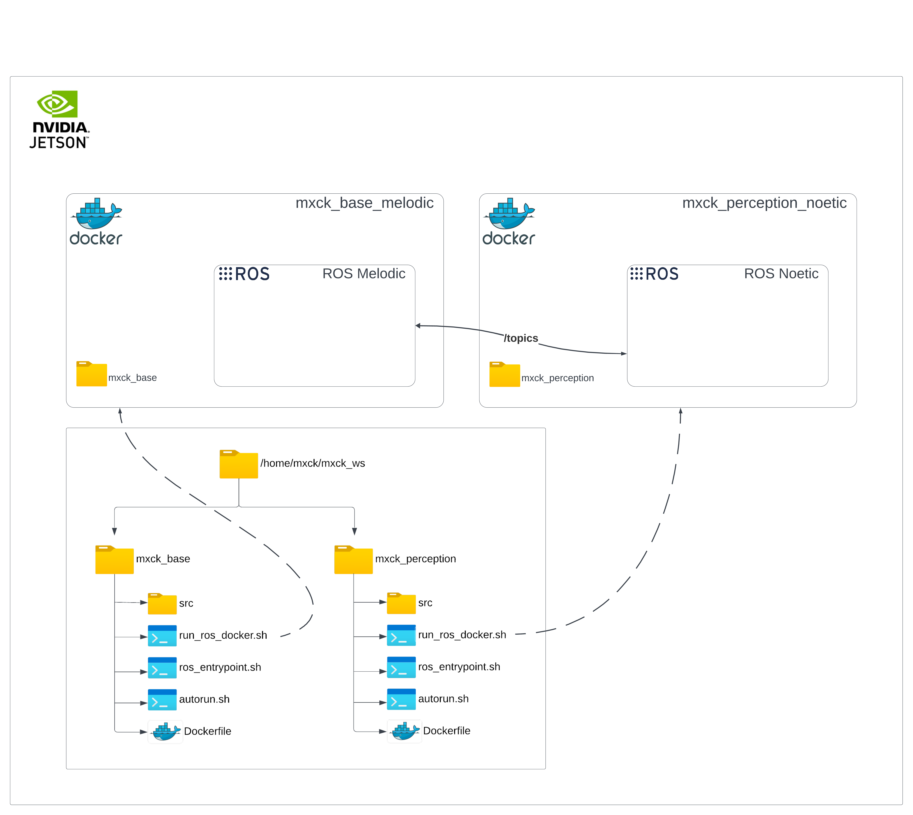

# MXCarkit ROS Workspace

## Quick Start

Clone this repository.
```bash
git clone -b mxck_base https://github.com/william-mx/mxck_ws.git ~/mxck_ws/mxck_base
```

Make shell scripts and python files executable.
```bash
cd ~/mxck_ws/mxck_base
sudo find . -type f -name '*.py' -o -name '*.sh' -exec chmod +x {} \;
sudo find . -type f -name '*.py' -exec dos2unix {} \;
```

Build docker image.
```bash
sudo docker build -t mxck_base_melodic .
```

Run docker image.
```bash
./run_ros_docker.sh
```

Next, use the following command to control different functionalities of the MXcarkit:

```bash
roslaunch mxck_run mxck_run.launch run_camera:=true run_foxglove:=true
```
This command starts live video streaming and data streaming to Foxglove Studio, enhancing real-time visualization capabilities. Several other options are available to customize the startup behavior of the MXcarkit. To explore these, check the `mxck_run.launch` launch file. 

If you need more terminals, just open another one and connect to the Docker container.
```bash
./add_ros_docker.sh
```


## MXcarkit Components and Wiring Overview


At the heart of the setup, we find the **NVIDIA Jetson**, which is the computing unit of the MXcarkit. A **USB Hub** is attached to it, expanding the maximum number of USB ports available. Both the USB Hub and the Jetson are powered by a **Powerbank**, ensuring a reliable power supply for operations. The Jetson operates with the JetPack SDK installed, utilizing `Ubuntu L4T (Linux for Tegra)` as its operating system, which is specifically optimized for high-performance computing and AI applications.

On the bottom left, the Microcontroller subsystem is presented. The core of this subsystem is an STM32 Nucleo microcontroller, which is connected via Micro USB to the Jetson. Depending on the ROS distribution utilized on the Jetson, there can be either `rosserial` for ROS or `micro-ROS` for ROS2 installed to facilitate communication. The Microcontroller is tasked with reading sensor data from the **RC Receiver**, the **Ultrasonic Sensors**, and the **IMU** (Inertial Measurement Unit), sending this data as ROS messages to the Jetson. In the reverse direction, it can receive messages from the Jetson to control the Lights via the **LED Driver**, demonstrating bidirectional communication capabilities.

On the bottom right, the VESC subsystem is illustrated. The **VESC**, an electronic speed controller, receives commands from the Jetson and controls the **BLDC motor** and the **servo motor** to drive the vehicle. This subsystem is powered by a **4S LiPo battery**. For optimal operation, the correct `VESC Firmware` must be flashed onto the VESC.

At the top right, the **Remote Controller** is noted for its role in sending a PWM Signal to the RC Receiver. This signal is then interpreted by the Microcontroller, which sends the data to the Jetson. Subsequently, the Jetson passes these commands to the VESC, prompting the vehicle to move.

Additionally, the setup includes the **RPLidar** and the **Intel D435i RealSense Camera** at the top, both of which are connected to the Jetson via USB. These sensors play critical roles in environmental perception, enabling advanced navigation and interaction capabilities for the MXcarkit.

This configuration illustrates a comprehensive and integrated approach to robotic vehicle design, leveraging the MXcarkit's modular components for a wide range of applications in robotics and autonomous systems.

## System Software and Firmware Configuration Overview

In the components overview at the top, we identify three critical subsystems: the Jetson, the VESC, and the microcontroller. Each subsystem's corresponding operating software or firmware is denoted in gray at the bottom right.

- **Jetson Configuration**: 
  - We install **NVIDIA's JetPack SDK** on the Jetson, which utilizes **Ubuntu L4T** as the operating system. 
  - Depending on the JetPack version, it is Ubuntu 18.04 for JetPack versions below a specific threshold, and Ubuntu 20.04 for newer versions. 
  - To flash the Jetson, first check your hardware version and then select the latest supported [JetPack version](https://developer.nvidia.com/embedded/jetpack-archive). 
  - It is recommended to install it using the SDK Manager. [Installation Guide](https://docs.nvidia.com/sdk-manager/install-with-sdkm-jetson/index.html).

- **Microcontroller Configuration**: 
  - You must choose the right firmware depending on the ROS Distribution you plan to use on your Jetson, whether it's ROS or ROS2. 
  - The instructions for flashing the Jetson and the firmware can be found [here](https://github.com/william-mx/MXcarkit/tree/main/stm_nucleo).

- **VESC Configuration**: 
  - It's necessary to write the correct VESC firmware on our VESC and set the motor and application configuration appropriately to match our vehicle hardware. 
  - The instructions, firmware, and configurations can be found [here](https://github.com/william-mx/MXcarkit/tree/main/vesc).

## MXcarkit Software Architecture



The software architecture of the MXcarkit is illustrated to provide a top-level view of how the system is structured. The central component of the MXcarkit, responsible for all its computing tasks, is an **Nvidia Jetson** module, and it operates on **Ubuntu L4T (Linux for Tegra)**.

Next, we look at two different ROS setups: `ROS Melodic` and `ROS Noetic`, each running in its own Docker container. What's interesting here is that they can see each other's `/topics`. This shows how ROS is designed to let multiple setups work together, making it easy for them to communicate, as we see with Melodic and Noetic.

An important detail is that ROS is not installed directly on the Jetson hardware. Instead, employing Docker containers helps streamline the setup process, ensuring that project contributors use the same versions of ROS, along with specific Python packages, CUDA, and other dependencies, thus avoiding version conflicts or missing dependencies.

Moving to the bottom part of the illustration, we focus on an important part of the filesystem at `/home/mxck/mxck_ws`. This directory is key because it holds all the software needed for the MXcarkit's ROS environment and the setups for our Docker containers. Inside `mxck_ws`, there are two different ROS workspaces: `mxck_base` and `mxck_perception`. Both of these workspaces have a similar setup, with the `src` (source) directory at their heart. This directory is crucial because it stores all the ROS packages that the MXcarkit needs to work. If you're new to this, taking some time to go through the [ROS Tutorials](https://wiki.ros.org/ROS/Tutorials) can be a great way to learn how ROS packages function and why they're important in the ROS world.

To initiate one of the Docker containers, the `run_ros_docker.sh` script is used, which incorporates a standard `docker run` command along with various options. A significant option is the `--mount` flag, ensuring that everything within the `mxck_base` directory is accessible and editable from inside the Docker container. For Docker novices, a comprehensive tutorial series like the one found on [Tutorialspoint](https://www.tutorialspoint.com/docker/index.htm) can be invaluable for learning the ins and outs of Docker usage.

Moreover, each workspace contains a `Dockerfile` which is scripted to build a Docker image. This file defines the version of ROS and the packages to be included, which means that adding new packages to be permanently available within the Docker image requires modifying the `Dockerfile` and rebuilding the image, thereby simplifying the process of extending the system's capabilities.


## Automating MXCarKit Setup: Configuration Guide


We've made a script called `startup_mxck.sh`. The `startup_mxck.sh` script is located in our repository at [https://github.com/william-mx/MXcarkit](https://github.com/william-mx/MXcarkit) and is automatically copied to the `/home/mxck/mxck_ws` directory when the `initial_setup.sh` script is executed. If for some reason this doesn't happen, you should manually copy it to the directory. It helps your computer connect to the MXCarKit right away when it starts. This script sets up a hotspot for connecting to the MXcarkit and starts basic programs like Foxglove to stream data live. This script contains two commands:

`sudo nmcli dev wifi hotspot ifname wlan0 ssid mxck0000 password mxck0000`: This command sets up a hotspot on the MXCarKit with the SSID `mxck0000` and password `mxck0000`. You'll need to customize the ID (e.g., change `0000` to match your specific MXcarKit ID, such as `0016`). The default IP address of the MXCarKit when running as a hotspot is `10.42.0.1`. Once connected to the hotspot, the car kit will be visible at this IP address.

The second command opens a new terminal and executes the `/home/mxck/mxck_ws/mxck_base/run_ros_docker.sh 'true'` command. The `run_ros_docker.sh` script initiates a ROS Docker container within our MXcarKit's mxck_base workspace. The `true` flag tells the script that an Entrypoint shell script should be executed when the container is launched.

To ensure the `startup_mxck.sh` script executes immediately when the car kit starts, follow these three steps:

1. **Search for the Startup Application Tool on your Jetson.** Once found, add a new entry with a meaningful name like `startup mxck`. In the command field, enter `/home/mxck/startup_mxck.sh` to specify the script that should run at startup.

2. **Enable automatic login for the mxck user.** This step is crucial because if the mxck user is not logged in automatically, the script will only start after manual login. Configuring automatic login allows Ubuntu to bypass the password prompt for the mxck user, ensuring the script runs seamlessly at boot.

3. **Modify the visudo configuration for password-less sudo access.** Without this, executing the script as a sudo user would require a password, introducing another manual step we aim to eliminate for automation. To edit the visudo config, use the command `sudo gedit /etc/sudoers`. At the end of the file, add the following line to grant the mxck user sudo access without a password:

    ```
    mxck ALL=(ALL) NOPASSWD: ALL
    ```

This line allows the mxck user to execute any command as sudo without being prompted for a password, ensuring the script can run automatically.


Before rebooting the Jetson and testing our `startup_mxck.sh` script, we want to understand which ROS nodes run when we start the `run_ros_docker.sh` script with the `true` argument. First, we look at the Dockerfile in our repository [https://github.com/william-mx/mxck_ws](https://github.com/william-mx/mxck_ws).

```
COPY ./autorun.sh /
ENTRYPOINT ["./autorun.sh"]
CMD ["false"]
```

This instructs the Docker container to start the `autorun.sh` script upon initialization, passing `false` as the default argument to the `autorun.sh` script.

Next, we examine the `autorun.sh` file in our repository. At the beginning of this script, it sources our ROS workspace. The most relevant part for us is the last code block:

```
# run command
if [ "$1" = "true" ];
then
  roslaunch mxck_run mxck_run.launch run_micro:=true run_foxglove:=true run_camera:=true run_motors:=false
else
  bash
fi;
```

When we pass `true` to the script, it will automatically execute a `roslaunch` command when the Docker container starts, launching specific ROS nodes. If any other value is passed (or by default, `false`), it will simply open a bash terminal, allowing us to manually interact with the container.

In the `mxck_run.launch` file, the arguments `run_micro:=true`, `run_foxglove:=true`, `run_camera:=true`, and `run_motors:=false` control various aspects of the MXcarKit's startup behavior:

- **`run_micro:=true`** activates rosserial communication with the microcontroller, enabling sensor data from devices like IMUs and ultrasonic sensors to be published to ROS topics.

- **`run_foxglove:=true`** starts data streaming to Foxglove Studio, allowing for real-time visualization of sensor data and camera feeds.

- **`run_camera:=true`** turns on the camera for live video streaming.

- **`run_motors:=false`** keeps the motors off by default for safety, preventing the MXcarkit from moving unexpectedly at startup.

Each argument toggles a specific feature of the car kit, directly affecting what capabilities are available immediately after the system boots.


Besides the discussed arguments, there are many more available for configuring the startup behavior of the MXCarKit. To explore all possible options, you can inspect the `mxck_base/src/mxck_run/launch/mxck_run.launch` file. This file contains detailed configurations for various features and components.


## Visualize ROS data
[Foxglove](https://foxglove.dev/ros) is a great tool to visualize your ROS data. The data can be viewed either locally on the Jetson or on any other computer as long it is connected to the same network.

Foxglove Studio can be run as a standalone desktop app or be accessed via your browser. At this point in time (11/2023), the desktop version is not supported on Jetsons Arm64 architecture, so we have to use the [Web Console](https://studio.foxglove.dev). Foxglove Studio currently requires Chrome v76+ so make sure you have the Chromium web browser installed ```sudo apt-get install chromium-browser```. Alternatively, the data can be visualized remotely on a second computer either via the [Web Console](https://studio.foxglove.dev) or via the [Desktop Version](https://foxglove.dev/download). **(recommended)**

All sensors and also the motors can be controlled via the mxck_run.launch file in the mxck_run package. The individual sensors can be controlled via command line arguments. Have a look at the launch file in order to understand the whole procedure. By default, all sensors are switched off. Let's start the camera and watch the video stream in foxglove.

```
roslaunch mxck_run mxck_run.launch run_camera:=true run_foxglove:=false
```
When running the Foxglove node, a UDP port is passed as an argument. By default this port has the value ```8765``` but you can also specify a different value. On the Jetson, we simply open the [Web Console](https://studio.foxglove.dev), click open connection, and enter ```ws://localhost:8765``` as the WebSocket URL.

On another computer, we first need to make sure that the Jeston and the computer are on the same Wi-Fi network. Then we have to find out the IP address of the Jetson (e.g. 192.168.178.39) using ```ifconfig```. Then we open Foxglove Studio on our computer, click on open connection, and enter ```ws://192.168.178.39:8765``` as the WebSocket URL.
