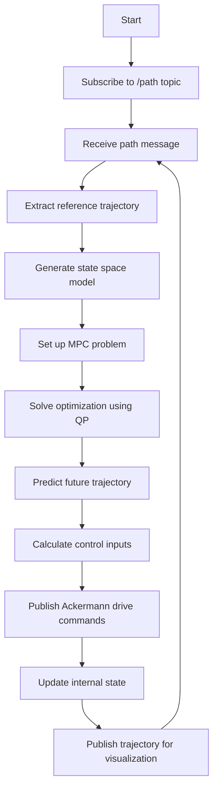


# Model Predictive Controller (MPC) for Autonomous Vehicle Path Following

  


## Table of Contents

1. [Overview](#overview)

2. [Key Features](#key-features)

3. [Algorithm Flow](#algorithm-flow)

4. [Code Structure](#code-structure)
   - [Initialization](#initialization)
   - [Path Processing](#path-processing)
   - [MPC Implementation](#mpc-implementation)
   - [Control Output](#control-output)

5. [Key Components](#key-components)
   - [State Variables](#state-variables)
   - [MPC Parameters](#mpc-parameters)
   - [Support Files](#support-files)

6. [Usage](#usage)

7. [Customization](#customization)

8. [Notes and  Problems](#notes-and-problems)


---

  

## Overview

  

This repository contains a ROS-based implementation of a Model Predictive Controller (MPC) designed for autonomous vehicle path following. The MPC algorithm is implemented in the `PathSubscriberNode` class, which subscribes to a path topic and publishes control commands to guide the vehicle along the desired trajectory. This MPC Controller is developed based on the "Applied Control Systems" course by Mark Misin on Udemy, as referenced below. For access to the course, please contact the owner of this repository. Currently, the controller operates solely in a simulated environment on a sinusoidal track. Additional issues and limitations are described below.   

For animation review the gif in the anmations folder.

---

  

## Key Features

  

1.  **ROS Integration**: Utilizes ROS topics for communication, subscribing to `/path` and publishing to `/autonomous/ackermann_cmd` and `/trajectorympc`.

2.  **Model Predictive Control**: Implements MPC to generate optimal control inputs for steering and acceleration.

3.  **Dynamic State Space Model**: Uses a state-space representation of the vehicle dynamics for prediction.

4.  **Quadratic Programming Solver**: Employs the `qpsolvers` library to solve the optimization problem.

5.  **Trajectory Visualization**: Publishes trajectory information for visualization purposes.

  

---

  

## Algorithm Flow

  

The following flowchart illustrates the high-level flow of the MPC algorithm:

  



  

---

  

## Code Structure

  

### Initialization

- Sets up ROS node, subscribers, and publishers

- Initializes MPC parameters and state variables

  

### Path Processing

-  `get_trajectory`: Extracts x, y coordinates and orientation from the received path message

  

### MPC Implementation

1.  **State Space Model**: Generates discrete state space matrices (Ad, Bd, Cd, Dd)

2.  **MPC Simplification**: Computes matrices for the optimization problem (Hdb, Fdbt, G, ht)

3.  **Quadratic Programming**: Solves the optimization problem to obtain control inputs

4.  **State Prediction**: Predicts future states based on the optimized control inputs


  

### Control Output

- Publishes Ackermann drive commands (steering angle and speed)

- Publishes trajectory information for visualization

  

---

  


## Key Components

### State Variables

| Variable      | Description                         |
|---------------|-------------------------------------|
| `x_dot`, `y_dot` | Velocities in x and y directions |
| `psi`, `psi_dot` | Yaw angle and yaw rate           |
| `X`, `Y`         | Position coordinates             |
| `U1`, `U2`       | Control inputs (steering angle and acceleration) |

### MPC Parameters

| Parameter  | Description                   |
|------------|-------------------------------|
| `Ts`       | Sampling time                 |
| `hz`       | Prediction horizon            |
| `outputs`  | Number of output variables    |
| `inputs`   | Number of input variables     |

### Support Files

The MPC implementation relies heavily on the `SupportFilesCar` class, which is defined in `support_files_car_general.py`. This class provides essential functionality for the MPC, including:

  

1.  `state_space(states, U1, U2)`: Generates the discrete state space matrices.

2.  `mpc_simplification(Ad, Bd, Cd, Dd, hz, x_aug_t, du)`: Computes matrices for the optimization problem.

3.  `open_loop_new_states_pred(states, U1, U2)`: Predicts the next vehicle state.

4.  `constants`: A dictionary containing various MPC parameters.

  

For detailed information about this class and its methods, refer to the `support_files_car_general.py` file in the repository.

  

---

  

## Usage

  

1. Ensure all ROS dependencies are installed

2. Launch the MPC node using the provided launch file:

```bash

roslaunch mpc run_mpc.launch

```

3. The node will subscribe to the `/path` topic and begin publishing control commands

  

---

  

## Customization

  

- Adjust MPC parameters in the `SupportFilesCar` class to tune controller performance

- Modify state space model for different vehicle dynamics

- Implement additional constraints or cost functions in the optimization problem

  

---

  

## Notes and Problems

  
- The current implementation is still in the testing phase.
- Due to the advanced nature of the bicycle model used, there are still some issues with path planning.
- Because of the complexity of the bicycle model, it is not possible to recreate the controlled RC car accurately, as the physics of real-life cars, such as cornering stiffness, are not equivalent.
- Another problem could be the unequal distances between the trajectory points. The controller needs the points to be equidistant in order to calculate the reference trajectory properly. This issue must also be fixed.
- MPC requires solving an optimization problem in real-time. Limited computational power on an RC car's onboard computer could also be an issue.
- Different solvers with faster solving were tested but the results were far away from perfect
- The current implementation assumes a constant longitudinal velocity of 1 m/s.
- At the time there is no implementation of a valuable speed change
- The code includes sections for additional visualizations using matplotlib and OpenCV.


  

By leveraging Model Predictive Control, this implementation provides a sophisticated approach to autonomous vehicle path following, allowing for anticipatory control actions and constraint handling.

  

---

## References

  

- [Applied Control Systems 1: autonomous cars: Math + PID + MPC](https://www.udemy.com/course/applied-systems-control-for-engineers-modelling-pid-mpc/?couponCode=LETSLEARNNOWPP)
- [Applied Control Systems 2: autonomous cars (360 tracking)](https://www.udemy.com/course/applied-control-systems-2-autonomous-cars-360-tracking/?couponCode=LETSLEARNNOWPP)


