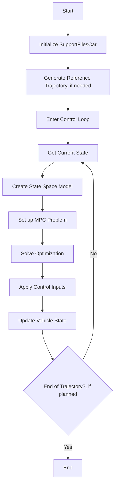
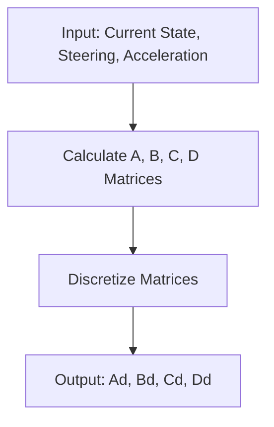
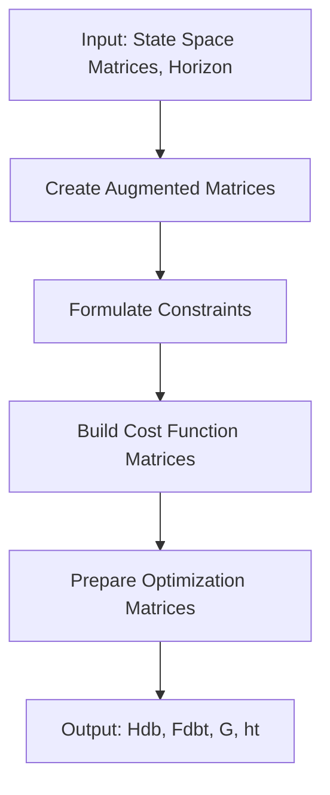



# Detailed MPC Support File Explanation

  

This document provides a comprehensive overview of the `SupportFilesCar` class, which contains essential functions for implementing Model Predictive Control (MPC) for a car-like robot.

  

## Table of Contents

  

1. [Class Overview](#class-overview)

2. [Detailed Method Explanations](#detailed-method-explanations)

3. [Key Concepts](#key-concepts)

4. [Flowcharts](#flowcharts)

5. [Usage in Main MPC Implementation](#usage-in-main-mpc-implementation)

  

## Class Overview

  

The `SupportFilesCar` class is designed to provide the necessary components for implementing MPC for a car-like robot. It is used to outsource some functions from the original Model Predictive Controller file. It handles the following key aspects:

  

- Initialization of vehicle and control parameters

- Generation of reference trajectories

- Creation and manipulation of state space models

- Formulation of the MPC problem, including constraints and cost functions

- Prediction of vehicle states

  

## Detailed Method Explanations

  

### `__init__`

  

This method initializes the constants and parameters used throughout the class. Key parameters include:

  

- Vehicle parameters: mass (m), moment of inertia (Iz), tire cornering stiffness front and back (Cf, Cr), wheelbase front and back (lf, lr)

- Control parameters: sampling time (Ts), horizon period (hz), weights for cost function (Q, S, R)

- Trajectory parameters

  

These parameters are crucial for accurately modeling the vehicle dynamics and setting up the MPC problem.

  

### `trajectory_generator`

  

This method generates the reference trajectory for the car to follow. In the current code the Trajectory is given and there is no need for this function. It processes a series of waypoints and calculates:

  

- Reference positions (x_ref, y_ref)

- Reference velocities (x_punkt, y_punkt)

- Reference yaw angles (psiInt)

  

The method also computes maximum allowable velocities based on the curvature of the path, ensuring safe navigation.

  

### `state_space`

  

This method forms the state space matrices and transforms them into discrete form. It takes the current states, steering angle (delta), and acceleration (a) as inputs. The process involves:

  

1. Calculating the elements of the continuous-time state space matrices (A, B, C, D) based on the vehicle dynamics model.

2. Discretizing the system using the forward Euler method to obtain discrete-time matrices (Ad, Bd, Cd, Dd).
It is important to calculate the Sampling time, in order to get the accurate distances of the waypoints. 
  

The state space model is crucial for predicting the vehicle's behavior in the MPC algorithm.

  

### `augmented_matrices`

  

This method creates augmented matrices for the state space model. Augmentation is performed to include the control inputs in the state vector, which is useful for handling input constraints in the MPC formulation.

  

### `mpc_simplification`

  

This is a key method that creates compact matrices for the MPC implementation. It performs several important tasks:

  

1. Builds the augmented matrices for the entire prediction horizon.

2. Formulates constraints for steering angle and acceleration.

3. Constructs the matrices for the quadratic cost function.

4. Prepares matrices for the optimization problem (Hdb, Fdbt, G, ht).

  

This method also implements an advanced Linear Parameter Varying (LPV) approach, updating the model at each step of the prediction horizon for improved accuracy.

  

### `open_loop_new_states` and `open_loop_new_states_pred`

  

These methods compute the new state vector for one sample time later. They use a more detailed model of the vehicle dynamics for accurate prediction, including:

  

- Computation of lateral tire forces

- Calculation of state derivatives

- Integration of state derivatives to obtain new states

  

The `_pred` version is specifically used for prediction in the MPC algorithm.

  

## Key Concepts

  

### Model Predictive Control (MPC)

  

MPC is an advanced control technique that uses a model of the system to predict future states and optimize control inputs over a prediction horizon. Key features of MPC include:

  

- Use of a receding horizon approach

- Handling of constraints on states and inputs

- Optimization of a cost function to determine optimal control inputs

  

### Vehicle Dynamics Model

  

The class uses a bicycle model for the vehicle dynamics, which includes:

  

- Longitudinal and lateral velocities

- Yaw rate and yaw angle

- Global position (X, Y)

  

This model captures the essential dynamics of the vehicle while remaining computationally tractable for real-time control.

  

### Linear Parameter Varying (LPV) Approach

  

The class implements an LPV approach, where the linear model is updated at each step of the prediction horizon. This improves the accuracy of predictions, especially for systems with significant nonlinearities.

  

## Flowcharts

  

### MPC Process Overview

  

  

### State Space Model Creation

  

  

### MPC Simplification Process

  

  

## Usage in Main MPC Implementation

  

The `SupportFilesCar` class is designed to be used in conjunction with a main MPC implementation file. A typical usage flow would be:

  

1. Initialize the `SupportFilesCar` class

2. Use `trajectory_generator` to create a reference path, if needed

3. Enter the control loop:

a. Get the current vehicle state

b. Call `state_space` to get the current linearized model

c. Use `mpc_simplification` to set up the MPC problem

d. Solve the optimization problem (using an external solver)

e. Apply the computed control inputs to the vehicle

f. Use `open_loop_new_states` to simulate the system's response

g. Repeat until the end of the trajectory

  

This support file provides the building blocks for implementing MPC, allowing the main implementation to focus on the high-level control logic and optimization solving.
