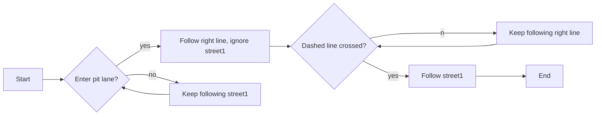
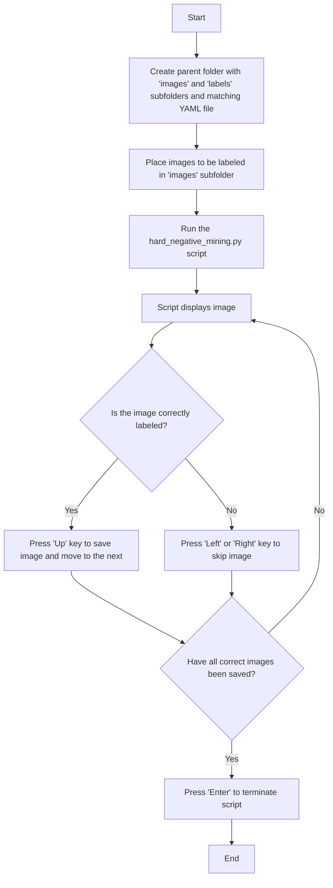

# Object and Lane Detection

The object and lane detection model on the MXCarKit for the VDI Autonomous Driving Challenge is based on **YOLOv8** from Ultralytics. YOLOv8 is a popular object detection and image segmentation model capable of performing a wide variety of tasks including detection, segmentation, pose estimation, tracking, and classification. For more information, visit the official [Ultralytics website](https://docs.ultralytics.com/).

## Object Detection

With YOLOv8, you can either use the **object detection** task or the **instance segmentation** task to train a model for detecting objects. The object detection task identifies objects in a picture and provides the coordinates of the corresponding bounding boxes. Unlike the instance segmentation task, it does not segment the individual object from the rest of the picture. As this is technically not needed for detecting objects like traffic lights, road signs, or other cars, the object detection task would be sufficient in this case. 

The reason behind still using instance segmentation instead of object detection is that deploying only one model is less data-intensive than deploying two separate models for lane and object detection. Since instance segmentation is essential for lane detection to work, both lane and object detection are merged into one instance segmentation model. 

## Traffic Sign Detection

In total, there are six different traffic signs that need to be distinguished. They can be split into three groups with two signs each:

| **Traffic Sign Group** | **Classes** | **Description** |
|--|--|--|
| **Parking Signs** | `parallel_parking`, `cross_parking` | Indicates allowed parking types |
| **No Passing Signs** | `no_passing`, `end_no_passing` | Indicates prohibition of passing |
| **Pit Lane Signs** | `pit_in`, `pit_out` | Marks pit entrance or exit |

Usually, a model based on YOLO has little to no issues differentiating between signs that are unique in their color or shape. Even though the traffic sign groups are easily distinguishable, the traffic signs within each group are the same color and generally share the same design. This makes it harder for the model to accurately detect the traffic signs. The problem mainly arises when not the whole sign can be seen.

For instance, the `parallel_parking` sign and the `cross_parking` sign are exactly the same except for the first word. If the first word on the traffic sign is covered, it's impossible to tell which sign it actually is. However, the model still recognizes part of the traffic sign and tries to identify it even though it is not possible to do so. This mostly leads to the covered parking sign being identified as both `parallel_parking`and `cross_parking`. To address this issue, only the first word of the parking signs is labeled, which results in the model not detecting the traffic sign at all if the first word of the sign cannot be seen. 

This issue only applies to the parking signs. Nevertheless, the pit lane signs are also partially labeled as a proactive measure. Still, because of the placement and direction of the arrows on the pit lane signs, the model has less difficulty distinguishing these signs from each other in comparison to the parking signs. 

The no passing signs are also different enough to not need partial labeling. Additionally, because of their design, it would be hard to define the exact segment to label. This results in the passing signs being labeled as a whole.

In conclusion, the model still performs best on the no passing signs while performing worst on the parking signs. This only underlines that unique symbols are significantly easier to identify. 

## Traffic Light Detection

Traffic lights are, similar to the passing signs, labeled as a whole. This is done to mitigate false positives from other light sources. Only if the model actually detects light as coming from an actual traffic light, it would try to identify the current signal. This leads to a total of five classes:

| **Class** | **Description** |
|--|--|
| `green` | The traffic light displays a green light |
| `orange` | The traffic light displays an orange light |
| `red_orange` | The traffic light displays a red and orange light |
| `red` | The traffic light displays a red light |
| `no_lights` | The traffic light is turned off |

The class `no_lights` is also important for reducing false positives, as the model would detect the traffic light even when turned off and try to assign it to an existing class. To accurately distinguish between all relevant signals, dividing into five classes showed the most promising results. 

## Lane Detection

Lane detection differs fundamentally from object detection, as it is no longer sufficient to only identify the bounding box and the intended class. Now it is also essential to know precisely where the lanes are located in the image, so a centerline can be determined. Several different approaches were attempted before deciding on a lane detection concept. The concepts are:

1. Using the pose estimation task from YOLOv8 to directly receive a centerline.
2. Segmenting the left and right line and subsequently calculating the centerline.
3. Segmenting the road between the left and right line and subsequently calculating the centerline.

Using pose estimation to directly receive the centerline would simplify later stages where a centerline would otherwise need to be calculated for the MXCarKit to follow. For this attempt, the centerline would be drawn by hand while keeping the same distance from the right line as from the left line. However, pose estimation models usually work by defining specific distinguishable keypoints. As neither the white lines nor the road between those lines contain any specific recognizable points, the model is not able to detect the centerline and therefore not suitable for this task.

Both segmenting the lines and segmenting the road in between those lines showed similarly promising results and are therefore implemented into the lane detection model. In addition, applying both concepts introduces redundancy, which potentially makes the system more robust in case one concept fails. 

This results in a total of three classes:

| **Class** | **Description** |
|--|--|
| `left` | The left line of the track |
| `right` | The right line of the track |
| `street1` | The road between the right and left line |

## Detection of the Pit Lane

In order for the MXCarKit to drive into the pit lane, it is necessary to consider various approaches for detecting the entrance of the pit lane. Those approaches were:

1. Labeling imaginary lines that lead directly to the pit lane.
2. Labeling an imaginary road that leads directly to the pit lane.
3. Using existing classes to lead the car to the pit lane.

Given that the first two approaches showed tremendously poor results in the early stages, option three remains the only viable choice. However, for option three to work, a strategy on how to use the existing classes in order to enter the pit lane needs to be developed. 

If the MXCarKit is not ordered to drive into the pit lane, it can use the `street1` class which is trained to ignore every road that's not directly in front, such as the pit lane. If the MXCarKit is ordered to drive into the pit lane, it can rely on the closest segmented right line. The right line directly leads the MXCarKit into the pit lane. If the dashed line in front of the pit lane is crossed, the model stops detecting the previously traveled road and starts to detect the pit lane as `street1`. The following flowchart shows the decision-making process for the MXCarKit regarding whether to drive into the pit lane or continue on the road.

It is important to keep in mind that due to the camera's field of view, the right line may not always be sufficiently visible if the MXCarKit is positioned too far to the right, which could make entering the pit lane more difficult.

In order to fully depict the pit lane itself, a few more classes need to be added, such as:

| **Class** | **Description** |
|--|--|
| `ps_horizontal` | The horizontal parking spaces in the pit lane |
| `ps_vertical` | The vertical parking spaces in the pit lane |
| `dashed_line` | The dashed lines |
| `car` | Other model cars on the track |

These classes complete all the information needed inside the pit lane.

## ROS Implementation

The ROS node `run_yolo.py` publishes two key topics:

1. **`/yolo/results`**: This topic provides the processed image with detected objects, which can be visualized using tools like Foxglove. The image includes annotations based on the YOLOv8 model's detection, segmentation, or pose estimation results.

2. **`/yolo/multi_array`**: This topic publishes detection results in a `Float32MultiArray` format. Each array element corresponds to a detected object and includes the following information:
   - **Detected Class:** Class ID for the detected class.
   - **Bounding Box Coordinates:** `[x1, y1, x2, y2]` representing the bounding box around the detected object.
   - **Confidence Score:** The model’s confidence in the detection.

This setup allows for both visual inspection of the results through the image topic and detailed analysis through the multi array topic.

## Hard Negative Mining Tool

The **hard negative mining tool** simplifies the labeling of images. The tool uses a currently trained YOLOv8 model to perform inference on images, which allows you to save correctly labeled images for further training while manually removing those that were misclassified.

The `hard_negative_mining.py` script enables the current YOLOv8 model to process each image sequentially, displaying them one by one. You can use the arrow keys to skip or save images, ensuring that only correctly detected images are retained while the others are deleted. Once the script has finished, the saved images and their corresponding labels are stored in "images" and "labels" subfolders. If the YAML file containing all the model classes is also located in the parent folder, you can directly upload the entire parent folder to a labeling tool such as Roboflow for further processing, if needed. The flowchart below illustrates the proper usage of the script.

