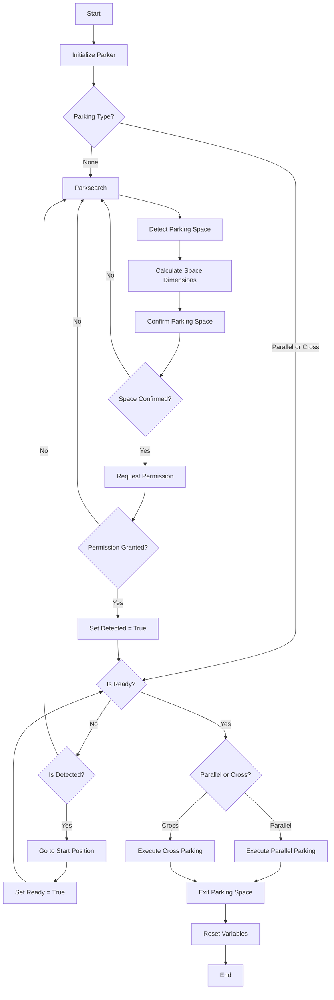

# run_parking

This script implements a parking algorithm for an autonomous vehicle using ROS (Robot Operating System). It processes ultrasonic sensor data and interacts with other ROS nodes to execute parking maneuvers.

 1. [Initial PDC-Data Analysis](#initial-pdc-data-analysis)
 2. [Rosbag Analysis](#rosbag-analysis)
 3. [Class ParkingSpace](#class-parkingspace)
 4. [Class Parker](#class-parker)

# Initial PDC-Data Analysis

The first attempts to analyze the behavior of PDC-Data provided valuable insights into potential methods for detecting parking spaces. The table below illustrates the results:

| Crossparking | Parallelparking |
|--------------|-----------------|
| |  |
|The front right sensor (dark blue in upper plot) consistently provided the most reliable data.|The front right sensor (dark blue in upper plot) again proved to be the most consistent data source.|
|At 5-6 seconds, the car approaches and drives alongside the first parked vehicle.|Between 5-6.75 seconds, the car approaches and drives alongside the first parked vehicle.|
|The car passes the cross-parking space between 6-6.25 seconds.|The parallel parking space is passed between 6.75-7.5 seconds.|
|At 6.25 seconds, the car reaches the end of the parking space, detecting the hood of the second parked car.|The end of the parking space is reached at 7.5 seconds, with the hood of the second parked car being detected.|

It's worth noting that the raw data from the front right, back side right, and back right sensors suffered from random noise spikes. This made them unsuitable for accurately measuring or detecting parking spaces without implementing a filter.

# Rosbag Analysis

Initially, the use of pre-recorded bag files was intended for executing parking maneuvers. However, the first attempts showed suboptimal results. To investigate the cause of the car's unexpected behavior, a bag file was recorded while the car autonomously followed a line and then replayed.

| Path during autonomous driving and recording | Path during bag file playback | Observations |
|----------------------------------------------|-------------------------------|--------------|
|  |  | After navigating the first two corners and a correction maneuver to realign with the center line, a discrepancy of 20 cm between the original path and the replayed path occured. |
|  |  | After an additional two meters of travel, the replayed bag file steered the car in a different direction, further increasing the path deviation. |

To address these discrepancies when using bag files, a correction sequence was implemented. This sequence manually overwrites specific indices with proven Ackermann messages. While this improved performance, the car's movements at very low speeds and short distances remained inconsistent. We suspect this may be due to an insensitive VESC and the absence of a rev-encoder.

The images below showcase three different outcomes of the same parallel parking maneuver, all starting from the same initial position and using identical code:

| Attempt 1 | Attempt 2 | Attempt 3 |
|-----------|-----------|-----------|
|  |  |  |

# Class ParkingSpace

The ParkingSpace class is responsible for classifying parking spaces based on input from object detection systems. It maintains the state of the detected parking space, including its type and relevant states for parking maneuvers.

1. [Initialized Variables](#initialized-variables)
2. [Class Functions](#class-functions)
   1. [__init__](#__init__)
   2. [callbackmultar](#callbackmultar)
   3. [replace_class_ids_with_names](#replace_class_ids_with_names)
   4. [parse_multiarr](#parse_multiarr)
   5. [set_variables](#set_variables)
   6. [detect_type_change](#detect_type_change)

## Initialized Variables

| Variable | Type | Description |
|----------|------|-------------|
| length | float | Length of the detected parking space |
| type | int | Type of parking space (0: none, 1: parallel, 2: cross) |
| type_old | int | Previous type of parking space |
| ready | bool | Indicates if the car is ready for manuvre |
| detected | bool | Indicates if a parking space has been detected |

## Class Functions

### __init__
Initializes the ParkingSpace object.
- Sets up initial variables
- Creates a subscriber for multi-array data from object detection

### callbackmultar
Callback function for multi-array subscription from object detection.
- Parses the received multi-array data
- Extracts class names and confidence levels
- Updates parking space type based on detected objects
- Calls `detect_type_change()` to handle any changes in parking type

### replace_class_ids_with_names
Replaces class IDs with corresponding class names in the multi-array data.
- Takes a multi-array and a dictionary of class names as input
- Returns the updated multi-array with class names instead of IDs

### parse_multiarr
Parses the raw multi-array message into a structured format.
- Extracts dimensions from the message
- Organizes data into a list of dictionaries containing class ID, coordinates, and confidence
- Returns the structured data

### set_variables
Initializes or resets all state variables to their initial values.
- Initializes the length of the parkingspace, type of parkingspace, ready state, and detection flag

### detect_type_change
Detects and handles changes in the parking space type.
- Compares current type with previous type
- Prints the new parking type if a change is detected
- Updates the previous type to the current type

# Class Parker

The Parker class manages the entire automated parking process, including detecting parking spaces, executing parking maneuvers, and controlling the vehicle's movements.

1. [Initialized Variables](#initialized-variables)
2. [Flowchart](#flowchart)
3. [Class Functions](#class-functions)
   1. [__init__](#__init__)
   2. [set_variables](#set_variables)
   3. [parking_callback](#parking_callback)
   4. [parksearch](#parksearch)
   5. [parkspace_calculator](#parkspace_calculator)
   6. [parkspace_positiv](#parkspace_positiv)
   7. [go_to_startposition](#go_to_startposition)
   8. [parking_parallel](#parking_parallel)
   9. [parking_cross](#parking_cross)

## Initialized Variables

| Variable | Type | Description |
|----------|------|-------------|
| parkingspace_measured | int | Flag for measured parking space (0: none, 1: parallel, 2: cross) |
| e_previous | float | Previous error for derivative calculation |
| derivative | float | Rate of change in distance measurements |
| time | rospy.Time | Current ROS time |
| time_float | float | Current time as a float |
| time_save_start | rospy.Time | Start time of space detection |
| time_save_start_float | float | Start time of space detection as a float |
| time_save_end | rospy.Time | End time of space detection |
| time_save_end_float | float | End time of space detection as a float |
| delta_time_save | float | Time difference for space detection |
| such_reset | float | Elapsed Time |
| time_safe | rospy.Time | Timestamp for timeout |
| time_safe_float | float | Timestamp for timeout as a float |
| distance0_1, distance1_1, distance0_2, distance1_2 | list | Lists for storing distance measurements |
| distance0, distance1 | list | Current distance measurements |
| parkspace | class | ParkingSpace class |
| t_previous | rospy.Time | Previous time for calculations |

## Flowchart

## Class Functions

### __init__
Initializes the Parker object.
- Sets up ROS publishers and subscribers
- Defines paths for bag files used in parking maneuvers
- Initializes variables and constants

### set_variables
Initializes all state variables to their initial values.
- Resets timers, distances, states and flags

### parking_callback
Callback function for ultrasonic sensor data.
- Filters and processes distance measurements
- Determines the current parking state and calls appropriate functions
- Calculates the derivative of distance measurements
- Publishes filtered distance measurements
- Reorders recieved sensor data in case of a faulty value

### parksearch
Searches for potential parking spaces.
- Detects the start and end of parking spaces based on pdc sensor data
- Measures the time taken to pass a potential parking space

### parkspace_calculator
Calculates the length of a detected parking space.
- Determines if the space is suitable for parallel or cross parking

### parkspace_positiv
Confirms if the measured parking space matches the predicted type.
- Requests permission to park via a ROS service call
- Sets the parking space as detected if permission is granted

### go_to_startposition
Moves the vehicle to the starting position for parking.
- Publishes Ackermann drive commands to move the vehicle

### parking_parallel
Executes the parallel parking maneuver.
- Uses a combination of predefined movements and bag file playback to manuvre into the parkingspace
- Includes a simulated delay for "getting groceries"
- Executes the maneuver to exit the parking space

### parking_cross
Executes the cross parking maneuver.
- Similar to parallel parking, uses predefined movements and bag file playback manuvre into the parkingspace
- Includes a simulated delay for "getting groceries"
- Executes the maneuver to exit the parking space
