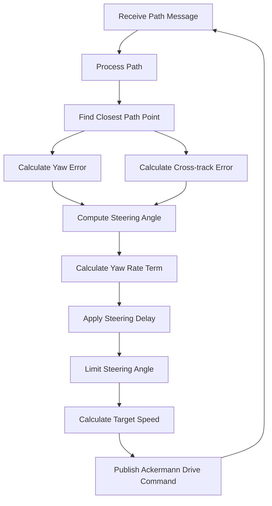

# Stanley Controller for Autonomous Vehicle Path Following

  

## Table of Contents

1. [Introduction](#introduction)

2. [Overview](#overview)

3. [Key Components](#key-components)

- [ROS Integration](#1-ros-integration)

- [Path Processing](#2-path-processing)

- [Stanley Control Algorithm](#3-stanley-control-algorithm)

- [Speed Control](#4-speed-control)

4. [Flowchart of the Stanley Control Algorithm](#flowchart-of-the-stanley-control-algorithm)

5. [Key Parameters](#key-parameters)

6. [Key Functions](#key-functions)

7. [Advantages of the Stanley Controller](#advantages-of-the-stanley-controller)

8. [Potential Improvements](#potential-improvements)

9. [Usage](#usage)

10. [Dependencies](#dependencies)

11. [Conclusion](#conclusion)

12. [References](#references)

  
  

## Introduction

  

The Stanley Controller is a path tracking algorithm widely used in autonomous vehicles for precise path following. This implementation is designed to work within a ROS (Robot Operating System) environment, specifically for vehicles using Ackermann steering geometry.

  

## Overview

  

The `stanley_controller.py` file implements a ROS node that subscribes to a path topic and publishes Ackermann drive commands to control the vehicle. It uses the Stanley control algorithm to calculate steering angles and adjust vehicle speed based on the path curvature.

  

## Key Components

  

### 1. ROS Integration

  

- Subscribes to the `/path` topic to receive the desired path

- Publishes to the `/autonomous/ackermann_cmd` topic to control the vehicle

- Utilizes ROS message types such as `Path` and `AckermannDriveStamped`

  

### 2. Path Processing

  

- Extracts x, y coordinates and yaw angles from the received path message

- Generates a cubic spline interpolation of the path for smooth tracking, this step is necessary to get the disered yaw angle of the closest point to the front axle

  

### 3. Stanley Control Algorithm

  

The core of the controller consists of several key calculations:

  

1.  **Target Path Point**: Finds the closest point on the path to the vehicle

2.  **Yaw Error**: Calculates the difference between the vehicle's heading and the path's tangent 

3.  **Cross-track Error**: Determines the lateral distance of the vehicle from the path

4.  **Yaw Rate Term**: Accounts for the vehicle's yaw rate to improve stability

5.  **Steering Delay**: Smooths out changes in steering angle

  

These components are combined to compute the final steering angle command.

  

### 4. Speed Control

  

Adjusts the vehicle's speed based on the path curvature:

- Slows down for tighter turns

- Speeds up for straighter sections

### 5. Track Recovery
Check for the published messages. If, for five seconds, no new messages were recieved, the driveback function reverses onto the track with a wider steering angle. If then new messages are recieved the conntroller again takes over. 
  

## Flowchart of the Stanley Control Algorithm

  

  

## Key Parameters

| Parameter      | Description                                | Effect                                            |
|----------------|--------------------------------------------|---------------------------------------------------|
| `k`            | Control Gain                               | Affects aggressiveness of steering corrections, higer k means higher steering angle     |
| `k_soft`       | Softening Gain                             | Reduces cross-track error impact at higher speeds  |
| `k_yaw_rate`   | Yaw Rate Gain                              | Influences responsiveness to yaw changes, higher steering angles with higer values           |
| `k_damp_steer` | Steering Damp Gain                         | Smooths out steering angle changes                 |
| `wheelbase`    | Vehicle Wheelbase                          | Affects the vehicle's turning radius               |
| `max_steer`    | Max Steering Angle                         | Limits the steeringangle                      |

## Key Functions

  

This section provides an overview of the main functions in the Stanley controller implementation:

  

### 1. `get_trajectory(msg)`

-  **Purpose**: Extracts the trajectory information from the received path message.

-  **Input**: ROS Path message.

-  **Output**: Arrays of x coordinates, y coordinates, and yaw angles.

-  **Description**: Processes each pose in the path message, extracting position and orientation information. Converts quaternions to Euler angles to get yaw.

  

### 2. `find_target_path_id(x, y, yaw)`

-  **Purpose**: Finds the closest point on the path to the current vehicle position.

-  **Input**: Current x, y position and yaw of the vehicle.

-  **Output**: Index of the closest path point, and the relative x, y distances to this point.

-  **Description**: Calculates the distance from the vehicle's front axle to each point on the path, then finds the point with the minimum distance (can be used if full path is given).

  

### 3. `calculate_yaw_term(target_index, yaw)`

-  **Purpose**: Calculates the yaw error between the vehicle and the path.

-  **Input**: Index of the target path point and current vehicle yaw.

-  **Output**: Yaw error (in radians).

-  **Description**: Computes the angle difference between the vehicle's heading and the path's direction at the target point. Normalizes the result to the range [-π, π].

  

### 4. `calculate_crosstrack_term(target_velocity, yaw, dx, dy, absolute_error)`

-  **Purpose**: Calculates the cross-track error term for steering correction.

-  **Input**: Target velocity, current yaw, relative x and y distances to the closest path point, and absolute error.

-  **Output**: Cross-track steering error and cross-track error.

-  **Description**: Computes the lateral distance of the vehicle from the path and converts it into a steering angle correction. The correction is adjusted based on the vehicle's speed.

  

### 5. `calculate_yaw_rate_term(target_velocity, steering_angle)`

-  **Purpose**: Calculates a correction term based on the vehicle's yaw rate.

-  **Input**: Target velocity and current steering angle.

-  **Output**: Yaw rate error term.

-  **Description**: Estimates the vehicle's yaw rate based on its velocity and steering angle, then calculates a correction term to improve stability.

  

### 6. `calculate_steering_delay_term(computed_steering_angle, previous_steering_angle)`

-  **Purpose**: Smooths out changes in the steering angle.

-  **Input**: Computed steering angle and previous steering angle.

-  **Output**: Steering delay error term.

-  **Description**: Calculates a term that reduces sudden changes in steering angle, promoting smoother steering behavior.

  

### 7. `stanley_control(x, y, yaw, target_velocity, steering_angle)`

-  **Purpose**: Implements the core Stanley control algorithm.

-  **Input**: Current x, y position, yaw, target velocity, and current steering angle.

-  **Output**: Desired steering angle, target path index, and cross-track error.

-  **Description**: Combines all the above calculations to determine the optimal steering angle. It calls the other functions in sequence and applies the steering angle limits.

  

### 8. `get_speed(yaw_angles, v_max, v_min, target_velocity)`

-  **Purpose**: Calculates the target speed based on path curvature.

-  **Input**: Array of yaw angles along the path, maximum and minimum velocities, and current target velocity.

-  **Output**: Adjusted target velocity.

-  **Description**: Analyzes the upcoming path curvature and adjusts the target speed accordingly. It slows down for curves and speeds up for straighter sections.

### 9. `driveback(self)`

-  **Purpose**: Gives commands to return the vehicle back on track.

-  **Input**: Nothing, gets called whenever no new messages are published an no track is recognized.

-  **Output**: Ackermann controls.

-  **Description**: Drives the vehicle backwards with a wider steeringangle

### 10. `callback(msg)`

-  **Purpose**: Main ROS callback function that processes new path messages.

-  **Input**: ROS Path message.

-  **Output**: None (publishes Ackermann drive commands).

-  **Description**: This function is called whenever a new path message is received. It processes the path, calls the Stanley control function to calculate the steering angle, determines the target speed, and publishes the resulting Ackermann drive commands.

  

These functions work together to implement the Stanley control algorithm, allowing the vehicle to accurately follow a given path while adjusting its steering and speed based on the path's characteristics and the vehicle's current state.

  
  

## Advantages of the Stanley Controller

  

1.  **Simplicity**: Easy to implement and understand

2.  **Effectiveness**: Good path-following performance, especially at higher speeds

3.  **Smooth Control**: Produces smooth steering commands

4.  **Adaptability**: Adapts to different speeds, reducing oscillations at higher velocities

  

## Potential Improvements

  

1.  **Dynamic Parameter Tuning**: Implement adaptive tuning based on current speed and path characteristics

2.  **Predictive Control**: Incorporate a look-ahead distance to anticipate upcoming path changes

  

## Usage

  

1. Ensure ROS is properly set up in your environment

2. Place the `stanley_controller.py` file in your ROS package

3. Run the node: `rosrun stanley stanley_controller.py`

  

## Dependencies

  

- ROS 

- Python 3

- NumPy

-  `transformations` library

- Custom `cubic_spline_interpolator` module (ensure it's in your Python path)

  

## Conclusion

  

The Stanley controller provides a robust solution for path following in autonomous vehicles. Its simplicity and effectiveness make it popular in robotics and autonomous driving applications. However, careful parameter tuning is necessary for optimal performance across different vehicle characteristics and operating conditions.

  

## References

  

- [Stanley: The robot that won the DARPA Grand Challenge](https://robots.stanford.edu/papers/thrun.stanley05.pdf)

- [ROS Documentation](https://wiki.ros.org/)

- [Stanley Controller](https://github.com/winstxnhdw/FullStanleyController)

