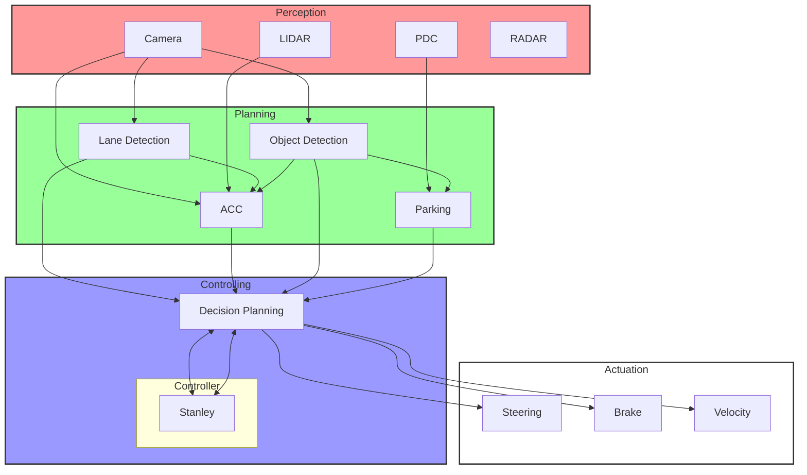
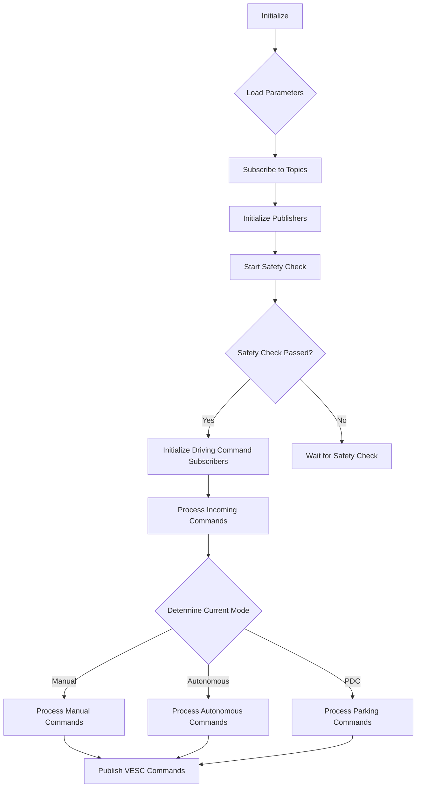
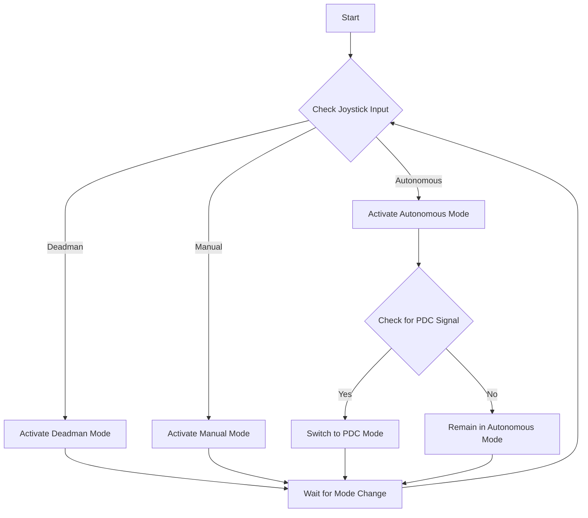

# Controlling

This repository contains a ROS node that converts Ackermann drive commands to VESC motor controller commands for autonomous vehicle control and decides based on its inputs which driving mode is correct for the present driving situation. It supports multiple driving modes, including manual, autonomous, and parking assist.

## Table of Contents

1. [Overview](#overview)
2. [Features](#features)
3. [Key Components](#key-components)
4. [Driving Modes](#driving-modes)
5. [Safety Features](#safety-features)

## Overview

The Controlling node is designed to interface between high-level control commands in the Ackermann drive format and low-level VESC motor controller commands. It supports various driving modes and integrates with other systems such as traffic light detection, object detecting, and autonomous parking. In future it will also make a decision which given path (track or box) will be chosen.

## Features

- Conversion of Ackermann drive commands to VESC motor commands
- Multiple driving modes: Manual, Autonomous, Deadman, and Autonomous Parking
- Integration with traffic light detection system
- Path planning for track following and parking maneuvers
- Dynamic parameter updates
- Safety checks and emergency braking (when red light is detected and deadman switch is selected)


## Key Components

## System Architecture

The following chart illustrates the high-level architecture of the autonomous vehicle control system:



This chart shows the main components of the system and how they interact:

1. **Perception**: Includes sensors like Camera, LIDAR, PDC (Park Distance Control), and RADAR.
2. **Planning**: Processes sensor data for Lane Detection, ACC (Adaptive Cruise Control), Object Detection, and Parking assistance.
3. **Controlling**: Includes Decision Planning and the Stanley controller for path following.
4. **Actuation**: Controls the vehicle's Steering, Braking, and Velocity based on decisions from the Decision Planning.

The AckermannToVESC node primarily operates within the Controlling and Actuation layers, translating high-level commands into low-level VESC motor control signals.


### AckermannToVesc Class

This is the main class that handles the conversion of Ackermann drive commands to VESC motor commands. Here's a flowchart of its main operations:



### Key Methods

1. `__init__(self, dynamic_update=False, interval=10)`: Initializes the node, sets up subscribers and publishers, and starts the safety check.

2. `update_mode(self, msg)`: Updates the driving mode based on joystick input.

3. `callback(self, ackermann_msg, target)`: Processes received driving commands based on the current mode.

4. `safety_check(self, ackermann_msg)`: Performs safety checks before enabling driving commands.

5. `pathplanning(self)`: Generates and publishes path data for the Stanley controller.

## Driving Modes

The system supports multiple driving modes:

1. **Deadman**: Initial safety mode where the vehicle doesn't respond to commands.
2. **Manual**: User-controlled driving through RC input.
3. **Autonomous**: Autonomous driving for track following.
4. **PDC (Park Distance Control)**: Autonomous parking mode.

Mode transitions are handled by the `update_mode` and `update_self_driving_mode` methods. Here's a flowchart of the mode transition logic:




## Safety Features

1. **Initial Safety Check**: The vehicle remains in Deadman mode until a safety check is passed.
2. **Emergency Braking**: Activated during mode changes or when required by higher-level systems.
3. **Speed Limiting**: Enforces speed limits based on various conditions (e.g., pit lane, ACC system).
4. **Traffic Light Compliance**: Automatically stops the vehicle at red lights.
5. **Confidence Threshold for Object Detection**: The system uses a confidence threshold when processing object detection results. This ensures that only high-confidence detections are acted upon, reducing the risk of false positives. For example:

   ```python
   if class_name in ['green', 'orange'] and confidence > 0.8:
       self.tl_green = True
   
   if class_name in ['no_lights', 'orange', 'green', 'red', 'red_orange'] and confidence > 0.8:
       self.tldet = True
   ```

   In this case, a confidence threshold of 0.8 (80%) is used for traffic light detection and classification, enhancing the reliability of the system's responses to traffic signals.

6. **Pit Ride Detection**: The system uses the same confidence threshold for detecting pit entry and exit points, ensuring accurate transitions between track and pit lane modes:

   ```python
   if class_name == 'pit_in' and confidence > 0.8:
       self.pitin = True
       self.pitout = False
       pit_ride = True
   
   if class_name == 'pit_out' and confidence > 0.8:
       self.pitout = True
       self.pitin = False
       pit_ride = False
   ```

These confidence thresholds add an extra layer of safety by reducing the likelihood of the system acting on false or low-confidence detections, which is crucial for the reliable operation of an autonomous vehicle.

## Implementation Details and Future Enhancements

This section outlines specific implementation details and planned enhancements for the Controlling infrastructure:

### The vehicle driver gives the command to exit the box

- The Parking-Team's  script is not triggered after 10 seconds, but can also be terminated by input from the remote control/driver. In this case, the mode changes from pdc_val to manu_val, and a service call informs the Parking-Team that the sequence for leaving the box will need to start immediately.

### Commands for following a vehicle

  - General agreement on a clear signal to be read from both sides (e.g., a light signal indicates that the vehicle in front should turn right). This can also be achieved through wireless communication or PDC (driving close to the car in front).
  - The path planning should then be modified to follow a line that is not the ideal center line, but for example, 20cm to the side of it, with reduced speed.


### GPS input will be integrated into the system

- The trajectory for the Stanley controller will now be based on GPS curve data and the actual line from the Lane Detection-Team.
- The controller should naturally follow the line it is given from the Lane-Detection. However, if multiple lines are available, the Controlling module gives the controller the desired line to follow.

### Safety Measures

- Absolute standstill and emergency braking when the traffic light is red or when the deadman mode is selected.


